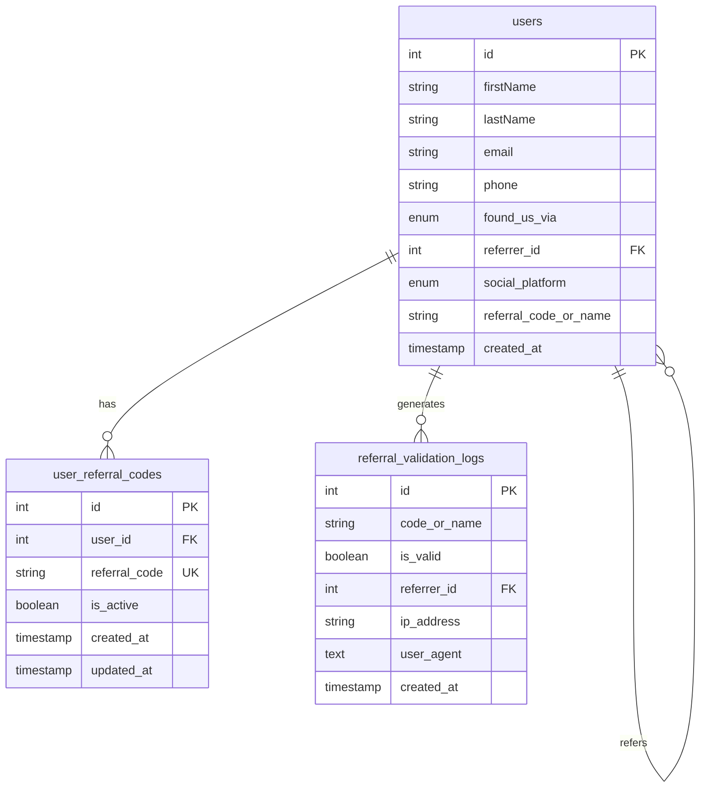

# How Found Us Database Schema

Αυτό το διάγραμμα δείχνει τη δομή της βάσης δεδομένων για τη λειτουργία "Πώς μας βρήκατε".

## Enum Values:

### found_us_via:
- `referral`: Σύσταση
- `social`: Social Media
- `google`: Google
- `site`: Website  
- `passing_by`: Πέρναγα απέξω
- `know_owner`: Γνωρίζω τον ιδιοκτήτη

### social_platform:
- `instagram`: Instagram
- `tiktok`: TikTok
- `facebook`: Facebook

## Key Features:

1. **Self-referencing**: users.referrer_id → users.id
2. **Custom Referral Codes**: Προαιρετικοί custom κωδικοί
3. **Validation Logs**: Audit trail για security
4. **Flexible Structure**: Υποστηρίζει όλες τις πηγές εγγραφής

## Indexes για Performance:

- `idx_users_found_us_via`
- `idx_users_referrer_id`
- `idx_users_social_platform`
- `idx_referral_code`