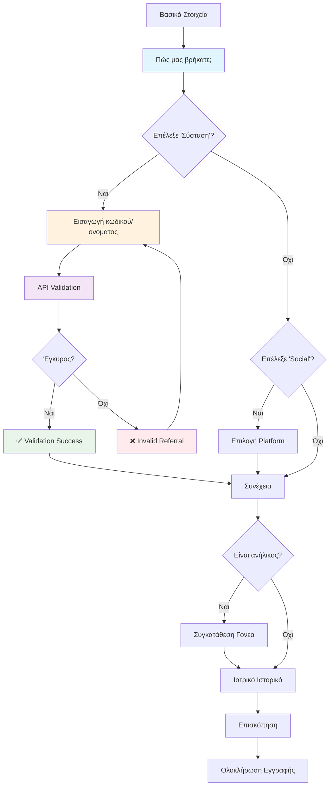

# How Found Us Registration Flow

Αυτό το διάγραμμα δείχνει τη ροή της φόρμας "Πώς μας βρήκατε;" στη διαδικασία εγγραφής.

## Επιλογές "Πώς μας βρήκατε":

1. **Σύσταση**: Απαιτεί validation με API call
2. **Social**: Απαιτεί επιλογή platform (Instagram/TikTok/Facebook)
3. **Google**: Άμεση συνέχεια
4. **Site**: Άμεση συνέχεια  
5. **Πέρναγα απέξω**: Άμεση συνέχεια
6. **Γνωρίζω τον ιδιοκτήτη**: Άμεση συνέχεια

## Validation Features:

- Real-time referral validation
- Security-first approach (no user enumeration)
- Rate limiting protection
- Error handling με user-friendly messages