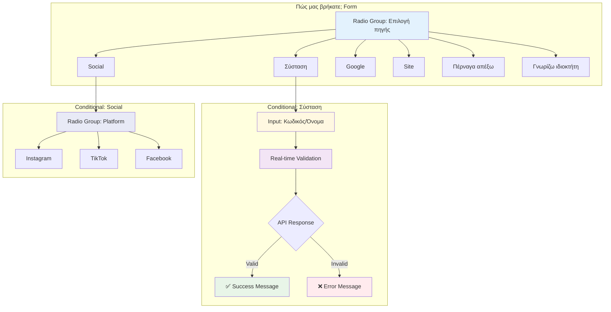

# How Found Us UI Components

Αυτό το διάγραμμα δείχνει τη δομή του UI για τη φόρμα "Πώς μας βρήκατε".

## UI Components:

1. **Main Radio Group**: Επιλογή πηγής εγγραφής
2. **Conditional Input**: Εμφανίζεται για "Σύσταση"
3. **Real-time Validation**: Live feedback για referral codes
4. **Social Platform Selection**: Υποκατηγορίες για social media
5. **Visual Feedback**: Success/error states με χρώματα

## UX Features:

- **Progressive Disclosure**: Conditional fields εμφανίζονται όταν χρειάζονται
- **Real-time Validation**: Άμεση ανατροφοδότηση χωρίς form submission
- **Visual Indicators**: Loading, success, και error states
- **Accessibility**: Proper labeling και keyboard navigation

## State Management:

- Form validation per step
- Conditional field reset όταν αλλάζει η επιλογή
- API call debouncing για performance
- Error handling με user-friendly messages