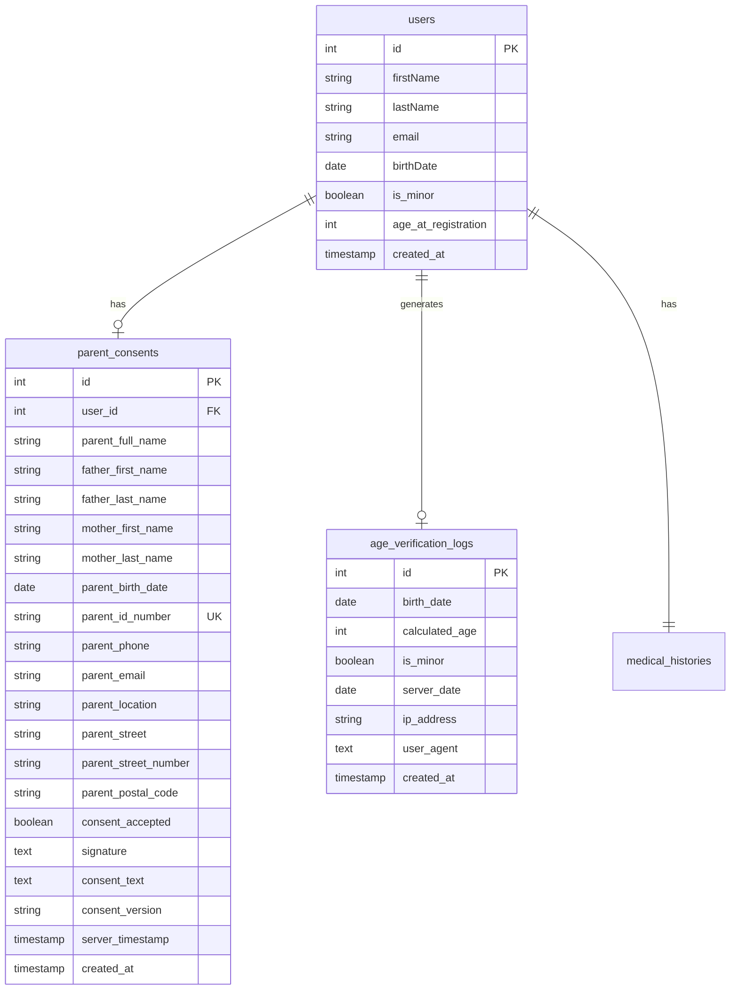

# Minor Registration Database Schema

Αυτό το διάγραμμα δείχνει τη δομή της βάσης δεδομένων για την εγγραφή ανηλίκων.

## Βασικά Χαρακτηριστικά:

1. **users.is_minor**: Boolean flag για ανήλικους
2. **parent_consents**: Αποθήκευση στοιχείων γονέα με υπογραφή
3. **age_verification_logs**: Audit trail για όλους τους ελέγχους ηλικίας
4. **server_timestamp**: Νομικά έγκυρη ημερομηνία από server

## Security & Compliance:

- Unique constraint στο parent_id_number
- Server timestamps για audit trail
- Encryption των υπογραφών (σε implementation level)
- Foreign key constraints για data integrity