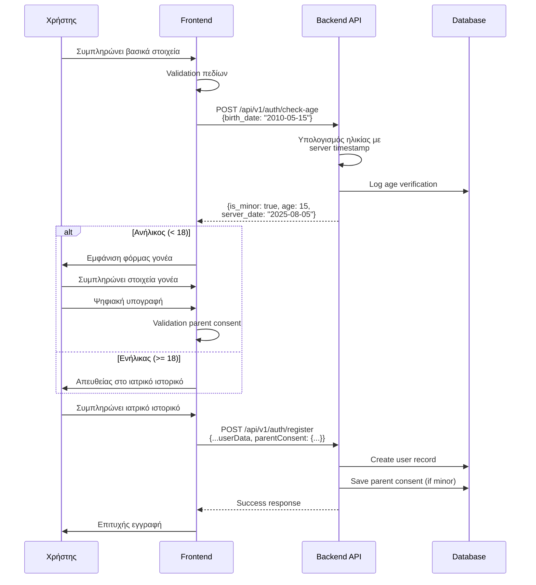

# Minor Registration Flow - Sequence Diagram

Αυτό το διάγραμμα δείχνει τη ροή για την εγγραφή ανηλίκων με έλεγχο ηλικίας στον server.

## Κρίσιμα Σημεία:

1. **Server-side Age Verification**: Ο έλεγχος ηλικίας γίνεται στον server για νομική εγκυρότητα
2. **Audit Trail**: Κάθε έλεγχος ηλικίας καταγράφεται στη βάση
3. **Conditional Flow**: Η ροή αλλάζει δυναμικά ανάλογα με την ηλικία
4. **Parent Consent**: Υποχρεωτική συγκατάθεση γονέα για ανήλικους